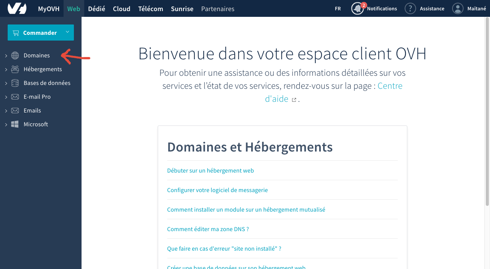
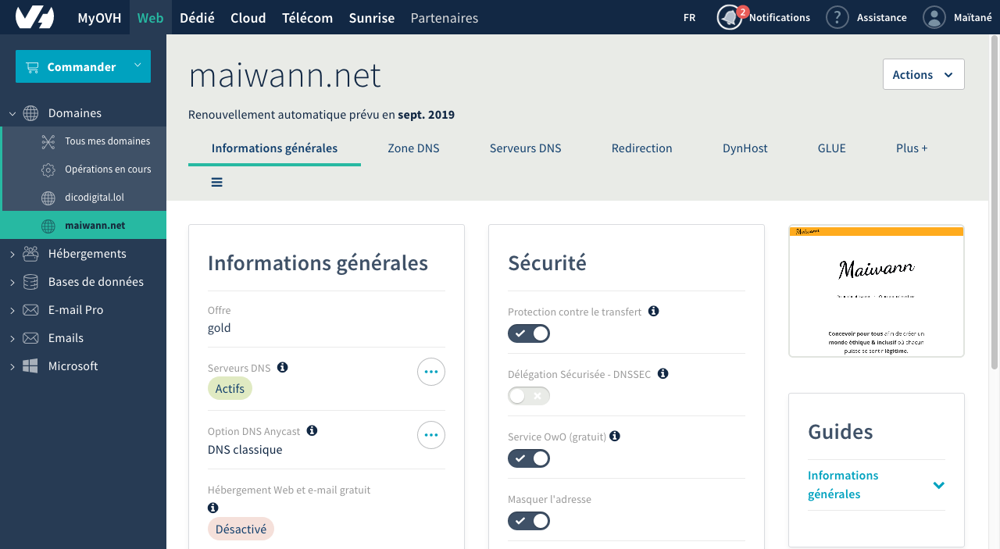
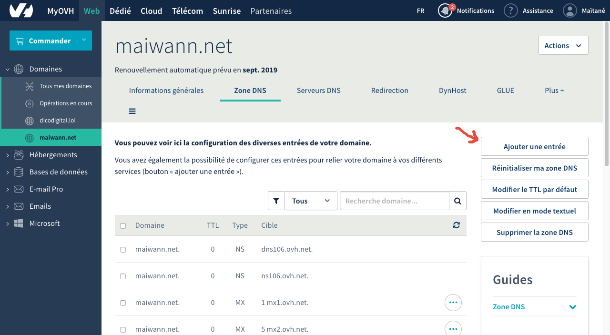
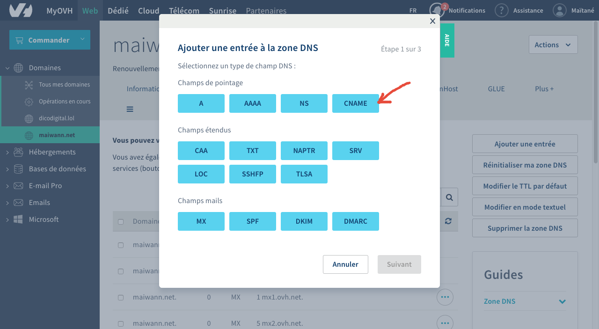
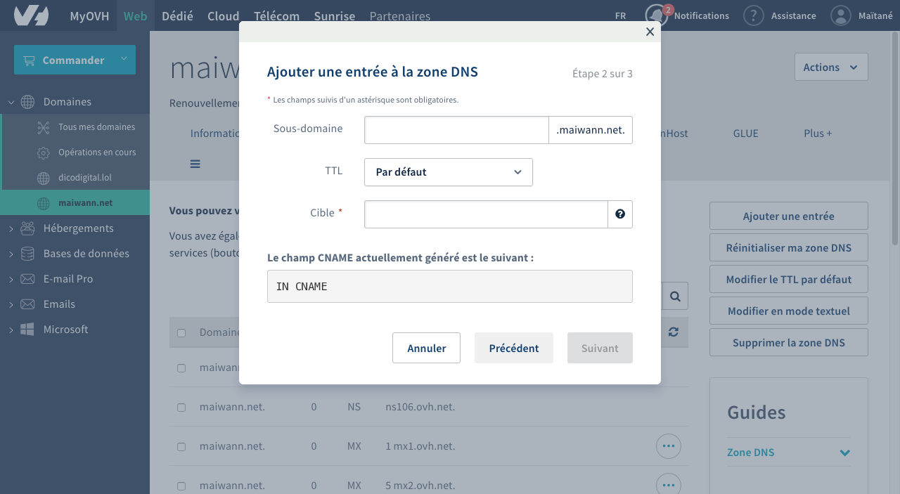
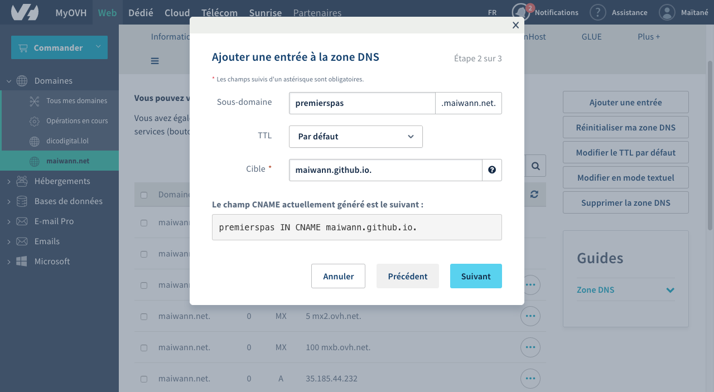

# Étape 4 : Mon url à moi

> L'exemple se fera avec OVH, parce que c'est mon hébergeur, mais je suppose que c'est plus ou moins transposable à n'importe quel site !

## Mon espace client OVH

Rendez-vous sur votre espace client, en vous connectant :)

Une fois connecté·e, je cherche à aller sur le nom de domaine qui m'intéresse (l'adresse qui doit correspondre à mon site)
Ici par exemple, pour moi, se sera maiwann.net

Je commence par sélectionner "Domaines" dans la barre de navigation à gauche

Puis, maiwann.net parmis les noms de domaines que l'on me propose, et voilà ce qui apparait :

Dans tout ça, je cherche les Zones DNS, car c'est leur paramétrage qui va me permettre de faire ce que je veux :

### Les zones DNS

Une fois que je suis dans l'onglet "Zone DNS", je vais créer une nouvelle entrée !
Je clique donc sur … "Ajouter une entrée", à droite dans l'écran de OVH

On me demande de "Sélectionnez un type de champ DNS :" et je clique sur **CNAME** dans "Champs de pointage" :)

Et j'arrive sur l'écran suivant

Que je remplis comme cela :

Sous-domaine : premierspas.maiwann.net
> Ca peut-être n'importe quel autre sous-domaine soit dit en passant !

TTL : Par défaut
> J'y touche pas :p

Cible : maiwann.github.io.
> Attention ici !! Il faut le remplir en mettant votrepseudo.github.io. (N'oubliez pas ce dernier point :D)

Et je valide !!

Ensuite, la 3e étape n'est remplis que d'informations, donc je la valide aussi :)
Petit point d'attention : vérifiez que vous n'avez pas, dans la liste de vos zones DNS (qui peut être sur plusieurs pages), un autre domaine cible qui sera nommé comme le sous-domaine que vous avez indiqué plus haut (c'était mon cas, ce qui a failli me provoquer des bricoles ^^') Si c'est le cas, supprimez le !

### Bravo !

Ca y est, vous êtes arrivés au bout du paramétrage coté OVH !!! BRAVO !!!

Si vous avez encore un peu d'énergie il reste une toute petite étape coté GitHub :)

## Coté GitHub

Retournez sur votre repository :)

Créez un nouveau document, que vous appelerez CNAME

Et à l'intérieur, vous n'écrivez qu'une seule ligne : le nom du sous-domaine que vous avez rentré dans OVH.

Pour moi, c'était premierspas.maiwann.net

Vous enregistrez, et c'est parti !

## HOP !

Et normalement, on est tout bon !!!! Bravoooo :3

Notez que pour moi ça a été quasiment immédiat, mais il est possible que le paramétrage des DNS mette 24h… Il faut être un peu patient…

Et ensuite, vous pourrez aller sur votre adresse web et tomber sur le même contenu que celui disponible sur l'adresse de github (que vous pouvez toujours retrouver dans Settings)

Youhouhou \o/

